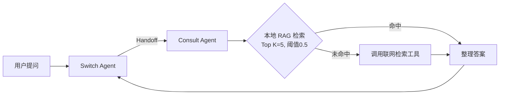
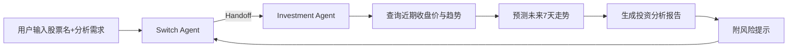

# 多智能体业务架构设计

> 项目：金融投资多智能体助理系统（Multi-Agent + Multi-MCP）
>
> 本系统采用 **OpenAI Agents SDK + MCP 协议**，由 **1 个调度智能体 + 4 个专业智能体**协同，每个专业智能体挂载独立的 MCP Server。系统保留三类业务（金融知识问答、股票投资分析、金融文章审查）并额外支持转人工服务。

---

## 一、智能体职责设计表

| 智能体 | 主要职责 | 可调用的 MCP 工具 | 何时触发 Handoff |
|---|---|---|---|
| **Switch Agent** | 业务转接调度中枢。理解用户意图，判断应交给哪个专业智能体；无合适对象时自行回答 | 无（不挂载 MCP Server，仅持有 handoffs 列表） | 当用户意图明确归属某专业领域（股票/文章审查/金融咨询/转人工）时，转交对应智能体 |
| **Investment Agent** | 股票投资分析：查询近期收盘价、判断涨跌趋势、预测未来 7 天走势、生成投资建议报告并附风险提示 | `stock_predict_mcp_server`：<br>• `predict_future_7data_tool`<br>• `cal_close_price_trend_tool`<br>• `generation_stock_prediction_report_tool` | 当用户咨询股票未来趋势、查询当前股价或需要生成股票投资报告时 |
| **Article Check Agent** | 金融文章风险审查：规范性审查、专业性审查、生成审查报告、对原文进行高质量改写 | `article_check_mcp_server`：<br>• `basic_check_tool`<br>• `professional_check_tool`<br>• `produce_check_result_report_tool`<br>• `produce_refine_report_tool` | 当用户希望审查文章风险、修改文章或生成审查意见报告时 |
| **Consult Agent** | 金融知识问答：先查本地知识库（RAG），无可靠答案时回退联网检索 | `finance_consult_mcp_server`：<br>• `invest_policy_consult_tool`（本地 RAG）<br>• `finance_news_search_consult_tool`（联网检索） | 当用户咨询金融政策、投资相关问题（需要知识问答）时 |
| **Human Agent**（代码中为 `turn_human Agent`） | 转人工服务：按当前业务场景（金融咨询 / 股票预测 / 文章审查 / 通用）转接对应人工客服 | `turn_human_server`：<br>• `turn_human_tool` | 当用户明确要求转人工，或业务需要人工介入时 |

> 说明：本系统 5 个智能体**全部启用**，无「本次未启用」项。

---

## 二、Handoff 关系（全互转）

系统采用**全互联互转**设计：Switch Agent 可转交任意专业智能体；4 个专业智能体之间可互转；所有专业智能体完成后均可回到 Switch Agent 等待下一轮。

```
                    ┌───────────────────────────┐
                    │        Switch Agent       │
                    │   （业务转接调度中枢）      │
                    └───┬───────┬───────┬───┬───┘
        Handoff ┌───────┘       │       │   └────────┐
                ▼               ▼       ▼            ▼
        ┌──────────────┐ ┌──────────────┐ ┌──────────────┐ ┌──────────────┐
        │Consult Agent │ │Investment AG │ │Article Check │ │ Human Agent  │
        │  金融知识问答 │ │  股票投资分析 │ │  文章风险审查 │ │   转人工     │
        └──────┬───────┘ └──────┬───────┘ └──────┬───────┘ └──────┬───────┘
               │                │                │                │
        finance_consult   stock_predict    article_check    turn_human
        MCP Server(9339)  MCP Server(8336) MCP Server(9330) MCP Server(8335)
               │                │                │                │
               └────────────────┴────────────────┴────────────────┘
                         完成后均 Handoff 回 Switch Agent
```

- **Switch → 专业 Agent**：由 `handoff_description` 驱动意图路由。
- **专业 Agent → 专业 Agent**：业务切换（如先问答后查股票）时直接互转。
- **专业 Agent → Switch**：任务完成且用户无后续问题时回到调度中枢，保证多轮业务连续性。

---

## 三、完整业务流程（箭头描述）

### 业务流程 1：金融知识问答（业务一）

**用户提问 → Switch Agent 识别为「金融咨询」→ Handoff 至 Consult Agent → 调用 `invest_policy_consult_tool` 查本地 RAG 知识库（Top K=5，相似度阈值 0.5）→ 判断相似度是否达到阈值 →（命中）直接生成回答 ／（未命中）调用 `finance_news_search_consult_tool` 联网检索 → 整理最终答案 → 移交回 Switch Agent**



### 业务流程 2：股票投资分析（业务二）

**用户输入股票名称与分析需求 → Switch Agent 识别为「股票分析」→ Handoff 至 Investment Agent → 调用 `cal_close_price_trend_tool` 查询近期收盘价与趋势 → 调用 `predict_future_7data_tool` 预测未来 7 天走势 → 调用 `generation_stock_prediction_report_tool` 生成投资分析报告（含风险提示）→ 移交回 Switch Agent**



### 业务流程 3：金融文章审查（业务三，补充）

**用户上传/指定金融文章 → Switch Agent 识别为「文章审查」→ Handoff 至 Article Check Agent → 读取文档文本 → 调用 `basic_check_tool` 规范性审查 → 调用 `professional_check_tool` 专业性审查 → 调用 `produce_check_result_report_tool` 生成风险审查报告（或 `produce_refine_report_tool` 改写）→ 移交回 Switch Agent**

---

## 四、系统整体架构

```
用户输入（命令行 / FastAPI / Gradio）
        │
        ▼
   Switch Agent（业务转接调度）
        │  按 handoff_description 决策转交
        ├─→ Consult Agent       → finance_consult_mcp_server (9339)  本地RAG + 联网检索
        ├─→ Investment Agent    → stock_predict_mcp_server   (8336)  查询/预测/报告
        ├─→ Article Check Agent → article_check_mcp_server   (9330)  规范/专业审查/改稿
        └─→ Human Agent         → turn_human_server           (8335)  转人工
                    │
              各专业 Agent 间通过 handoffs 互转
              完成后回 Switch Agent 等待下一轮
                    │
            会话状态（Session）隔离：session_id → {messages, current_agent, user_id}
```
